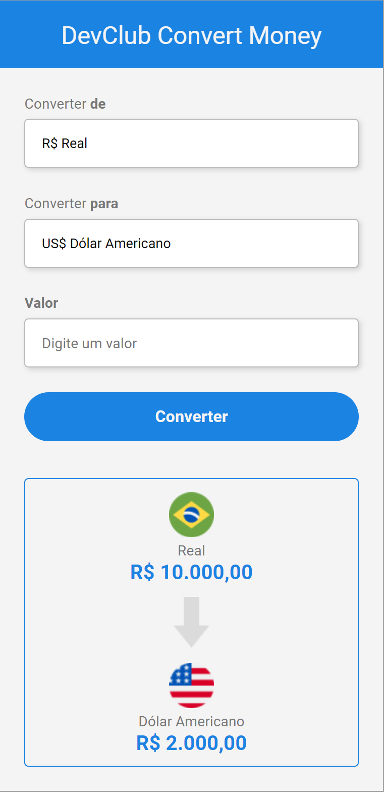

<h1 align="center"> Convert Money </h1>

 

  

 

[ 🔗 Clique aqui para acessar](https://antoniofarjala.github.io/convert-money)
 
## 🚀 Tecnologias

Esse projeto foi desenvolvido com as seguintes tecnologias:

- HTML e CSS
- JavaScript

## 💻 Projeto

O DevClub Convert Money é um componente que simula um conversor de moedas, onde é possível atualizar elementos HTML via DOM.

